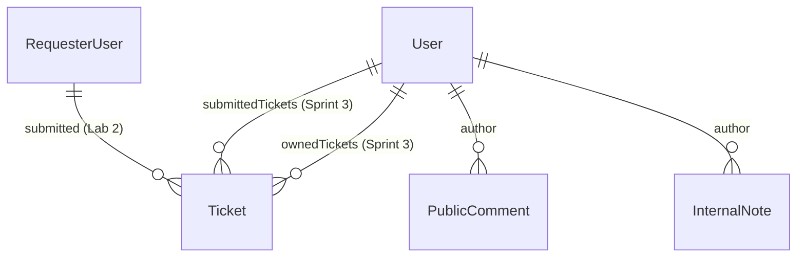

# Sprint 3 Phase 2: Data Migration Strategy

## Executive Summary
This document outlines the data migration strategy for transitioning TokTickIT from the temporary Lab 2 `RequesterUser` model to the unified Sprint 3 `User` model, while preserving foreign key integrity, ticket ownership, categories, related systems, and attachments.

---

## 1. Context & Architectural Changes

In Lab 2, user identity was managed via a lightweight `RequesterUser` table without authentication or role distinction. Sprint 3 replaces this with a unified `User` model supporting role-based access control (`REQUESTER`, `IT_STAFF`, `ADMINISTRATOR`), encrypted password hashes, and mandatory password change flags.



---

## 2. Model Mapping Matrix

| Lab 2 `RequesterUser` Field | Sprint 3 `User` Field | Transformation Rules |
| :--- | :--- | :--- |
| `id` | `id` | Preserved directly to maintain `Ticket.requesterId` foreign keys |
| `name` | `name` | Copied directly |
| `email` | `email` | Copied directly (unique constraint enforced) |
| N/A | `passwordHash` | Hashed value of default password `Password123!` using `bcrypt` (salt rounds = 10) |
| N/A | `role` | Set to `"REQUESTER"` for all migrated Lab 2 users |
| N/A | `mustChangePassword` | Set to `false` for existing migrated users; `true` for newly seeded initial accounts |
| `isActive` | `isActive` | Copied directly (`true`/`false`) |
| `createdAt` | `createdAt` | Copied directly |
| `updatedAt` | `updatedAt` | Copied directly |

---

## 3. Migration Execution Steps

1. **Schema Migration**:
   - Create table `User` with columns `id`, `name`, `email`, `passwordHash`, `role`, `mustChangePassword`, `isActive`, `createdAt`, `updatedAt`.
   - Add nullable column `ownerId` to `Ticket` referencing `User(id)`.
   - Add column `itPriority` to `Ticket` defaulting to `"MEDIUM"` (initially equal to `requestedPriority`).
   - Create tables `PublicComment` and `InternalNote` referencing `Ticket(id)` and `User(id)`.

2. **Data Copy & Transformation (SQL / Seed Query)**:
   ```sql
   -- Conceptual SQL for environments with existing data:
   INSERT INTO "User" ("id", "name", "email", "passwordHash", "role", "mustChangePassword", "isActive", "createdAt", "updatedAt")
   SELECT 
     "id", 
     "name", 
     "email", 
     '$2a$10$wW5q6uYV2Z8aX...' AS "passwordHash", -- bcrypt hash of 'Password123!'
     'REQUESTER' AS "role",
     0 AS "mustChangePassword",
     "isActive",
     "createdAt",
     "updatedAt"
   FROM "RequesterUser";
   ```

3. **Foreign Key Alignment**:
   - Update `Ticket.requesterId` foreign key to point from `RequesterUser.id` to `User.id`.
   - Drop the temporary `RequesterUser` table once references are verified.

4. **Rollback & Safety Plan**:
   - Database back-ups are created prior to schema execution.
   - All user deletion operations are replaced by setting `isActive = false`, ensuring no cascading deletions affect ticket history.

---

## 4. Idempotency & Seeding Integration

In `server/prisma/seed.ts`:
- All user insertions utilize `prisma.user.upsert({ where: { email } })`.
- Seed data ensures all Lab 2 requesters (`jennifer.anderson@example.com`, `michael.brown@example.com`, `sarah.jenkins@example.com`, `david.lee@example.com`, `alex.turner@example.com`) are preserved cleanly alongside new Sprint 3 seeded Requesters, IT Staff, and Administrators.
